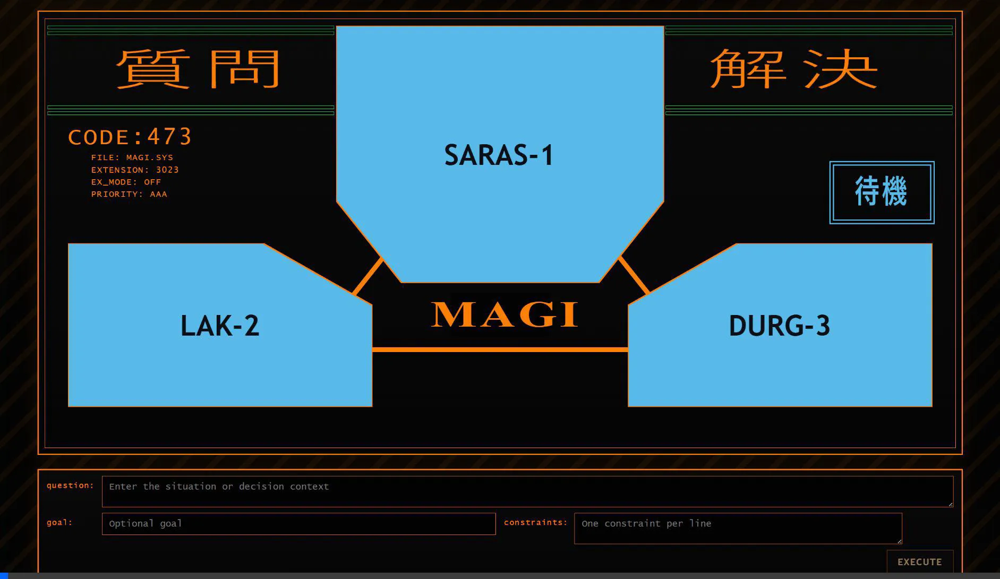
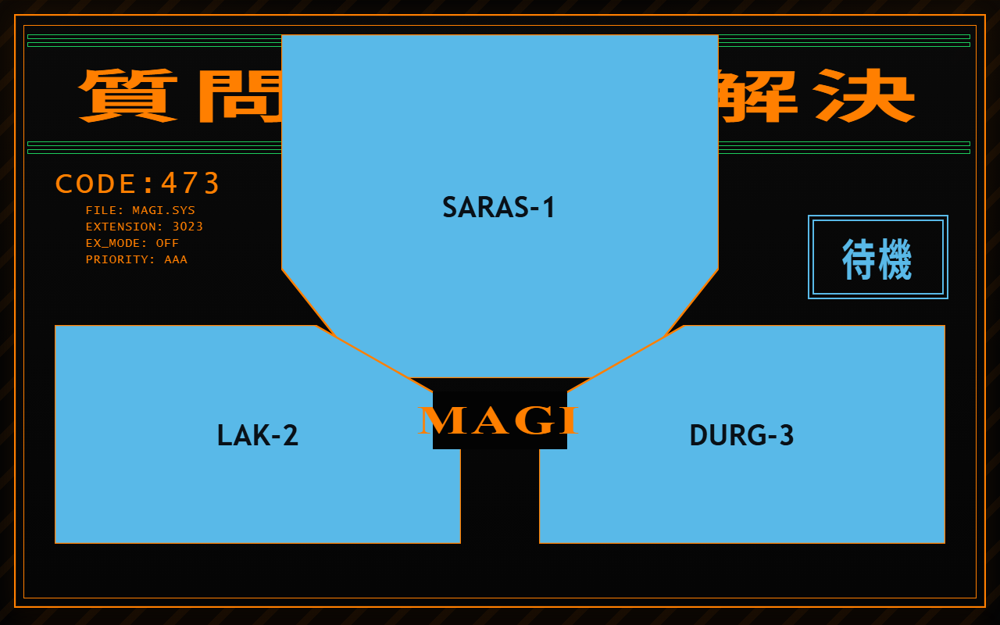
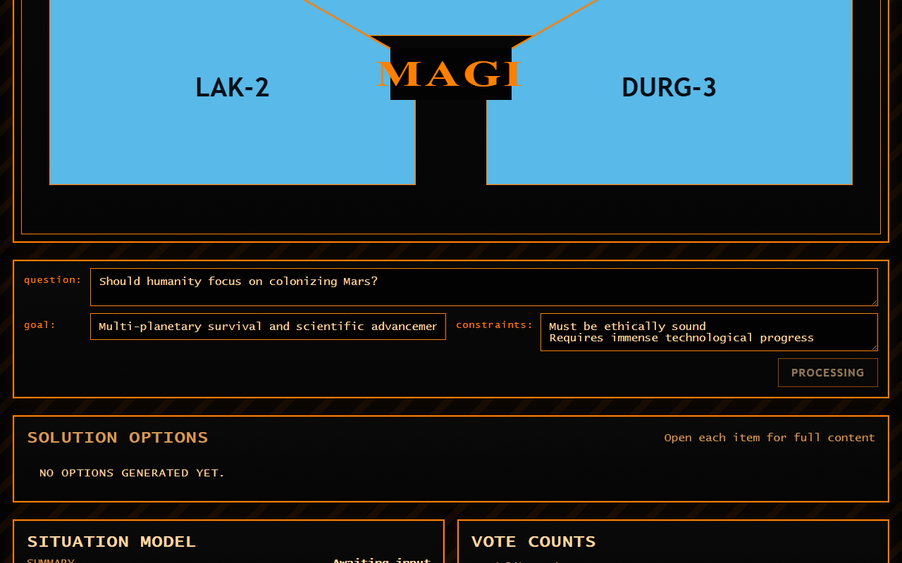

# MAGI

Local MAGI-style deliberation engine with a FastAPI backend, an Ollama-driven multi-model pipeline, and the `magi_ui` React dashboard.

## Demo

Here is a short video demonstrating the UI in action, along with some screenshots of its states:



### Interfaces

<div style="display: flex; justify-content: space-between;">
  
  
</div>

## Ollama Models

The backend currently expects these Ollama models from [backend/config.py](c:/Users/IshaanV/Documents/GitHub/MAGI/backend/config.py):

- `phi4-mini-reasoning:latest`
- `qwen2.5:3b`
- `gemma2:2b`
- `phi3:mini`

Pull them before starting the app:

```powershell
ollama pull phi4-mini-reasoning:latest
ollama pull qwen2.5:3b
ollama pull gemma2:2b
ollama pull phi3:mini
```

Make sure the Ollama server is running on `http://localhost:11434`.

## Start the Backend

From the repo root, install the Python dependencies:

```powershell
pip install -r backend/requirements.txt
```

Then start the API with:

```powershell
python main.py
```

That launches the FastAPI app from [main.py](c:/Users/IshaanV/Documents/GitHub/MAGI/main.py) on `http://localhost:8000`.

If you prefer, you can run the same app directly with Uvicorn:

```powershell
uvicorn backend.main:app --reload
```

## Start the UI

The active frontend for this project is `magi_ui`.

```powershell
cd magi_ui
npm install
npm run dev
```

Vite will print the local dev URL, typically `http://localhost:5173`.

## Run Order

Start things in this order:

1. Start Ollama.
2. Start the backend with `python main.py`.
3. Start the UI with `cd magi_ui` and `npm run dev`.

The UI sends requests to `http://localhost:8000/api/decide`, so the backend must be running before you submit a decision.
